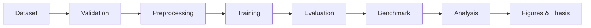
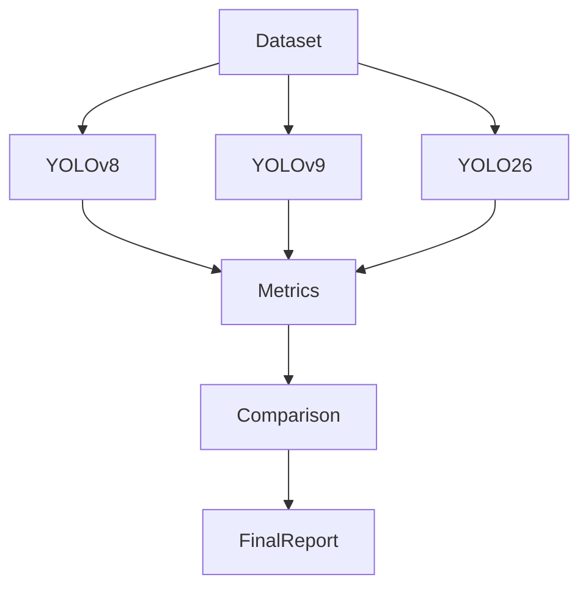
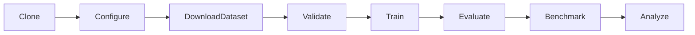

# Pediatric Wrist Fracture Detection & Localization

> A reproducible research infrastructure for benchmarking modern YOLO architectures on pediatric wrist fracture detection and localization from radiographs.

## Overview

This repository accompanies a bachelor's research project in Computer Engineering focused on object detection for pediatric wrist fractures. Rather than implementing a single training script, the project provides a complete experiment pipeline including dataset preparation, experiment configuration, model training, benchmarking, evaluation, visualization and reproducibility utilities.

The primary research model is **YOLO26**, while **YOLOv8** and **YOLOv9** are included as controlled baselines for fair comparison.

## Highlights

- Reproducible experiment pipeline
- Configuration-driven workflow
- Support for YOLOv8, YOLOv9 and YOLO26
- Smoke and full experiment profiles
- GPU preflight validation
- Dataset inspection and validation
- Benchmark generation
- Evaluation utilities
- Publication-ready outputs

## Repository Architecture

```text
configs/
    dataset/
    hardware/
    models/
    runs/

data/
docs/
outputs/
scripts/
tests/
```

## Research Workflow



## Experiment Pipeline



## Installation

```bash
git clone https://github.com/RMA1313/pediatric-wrist-fracture.git
cd pediatric-wrist-fracture

uv sync
```

## Project Structure

| Directory | Purpose |
|-----------|---------|
| configs | Experiment configuration |
| data | Dataset location |
| docs | Research documentation |
| outputs | Generated artifacts |
| scripts | Dataset, training and evaluation utilities |
| tests | Validation tests |

## Configuration

Experiments are controlled through YAML files.

- configs/project.yaml
- configs/dataset.yaml
- configs/experiment.yaml
- configs/models/
- configs/hardware/
- configs/runs/

No source-code modification is required to switch models or hardware profiles.

## Supported Models

| Model | Role |
|------|------|
| YOLOv8 | Baseline |
| YOLOv9 | Comparative baseline |
| YOLO26 | Primary research model |

## Typical Workflow



## Scripts

The repository contains utilities for:

- dataset acquisition
- dataset inspection
- dataset validation
- GPU validation
- benchmarking
- evaluation
- training
- environment auditing

## Reproducibility

The project was designed around reproducible research principles:

- configuration-first design
- deterministic execution
- patient-level dataset split
- fixed experiment protocol
- benchmark reproducibility
- experiment documentation

## Research Scope

This repository is intended for research purposes.

It is **not** a medical device and must not be used for clinical diagnosis.

Any medical deployment requires regulatory approval and prospective clinical validation.

## RTL Inference Demo

The repository now includes a separate Persian RTL demo under `demo/` for inference-only use with the trained `best.pt` checkpoints.

- Frontend: `demo/frontend`
- Backend: `demo/backend`
- Demo README: [demo/README.md](demo/README.md)

The demo is isolated from training, evaluation, calibration, and reporting code paths.

## Citation

```bibtex
@misc{seddiqmirzaei2026,
  title={Pediatric Wrist Fracture Detection and Localization},
  author={Mohammad Erfan Seddiq Mirzaei},
  year={2026},
  note={Bachelor Thesis, Amirkabir University of Technology}
}
```

## License

See LICENSE.
